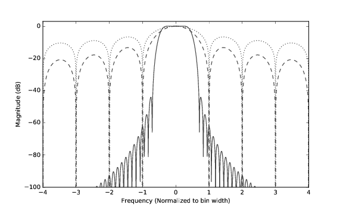
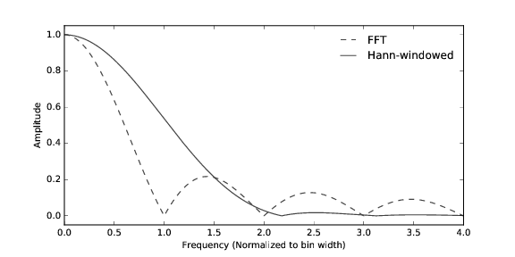
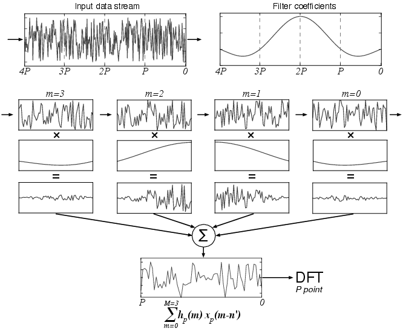
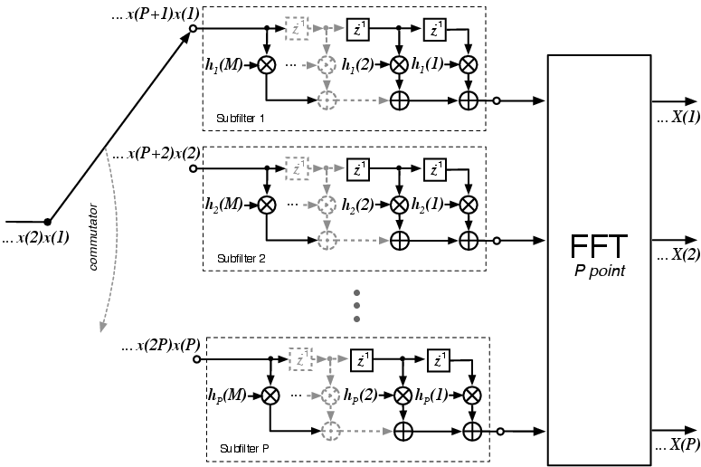
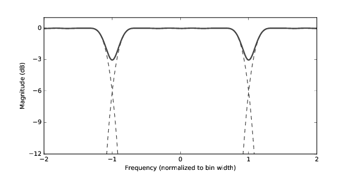
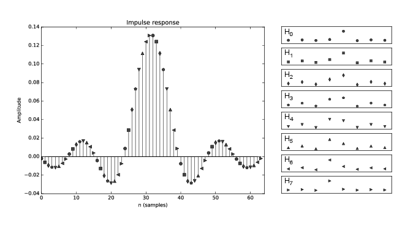
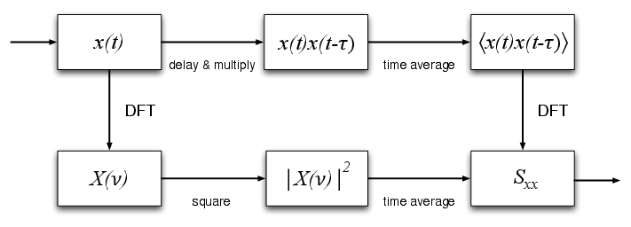
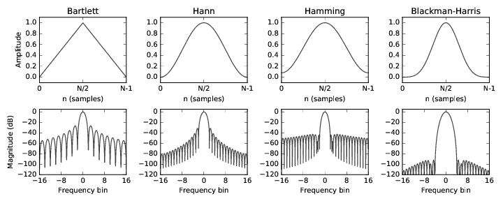

### PFB diagrams

These diagrams are licensed under [CC-BY 4.0](https://creativecommons.org/licenses/by/4.0/). So yes, you can use them in a thesis / paper / blog post, as long as you follow the CC-BY rules.

##### fb_comparison.pdf

---

Comparison between ACS (dotted), FTF (dashed) and PFB 8-tap Hann windowed PFB filter responses.

##### fft_resp.pdf

---

Effect of applying a windowing function to an FFT. The main lobe is broadened but the sidelobes are supressed.

##### fir_filter.pdf

---

Block diagram showing a FIR filter.

##### pfb_chart.pdf

--- 

The diagram shows an input signal being divided into *M* taps, each with *P* points. Within each tap, the signal is  multiplied by the filter coefficients, then a sum across taps is performed. After this, another *P* points are read, and the signals propagate left-to-right into the next tap (following the arrows).

##### pfb\_fir\_fft.pdf

---

Streaming DSP style diagram showing the PFB frontend connected to a FFT to form a polyphase filerbank.

##### pfb\_scalloping.pdf

---

Diagram showing scalloping loss between channels of a spectrometer

##### pfb_taps.pdf

---

Another way of looking at taking filter coefficients and breaking them into subfilters.

##### wiener.pdf

---

The Wiener-Khinchin relation, and how it relates to spectrometers to compute the PSD.

##### window_fns.pdf

Windowing functions and their magnitude squared filter response (i.e. spectrometer channel shape).
